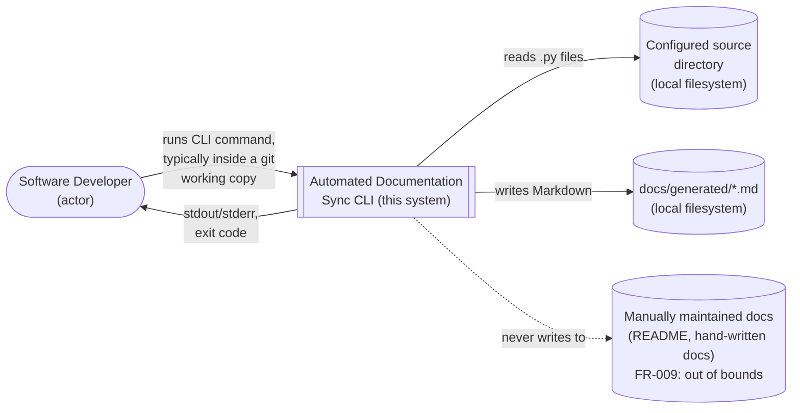
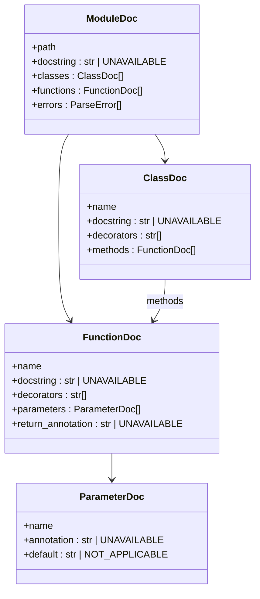

# Architecture: Automated Documentation Sync (v1)

Status: **Proposed — pending follow-up Design Review (Gate G2 not yet
passed).** This document was revised on 2026-09-24 under the `CLAUDE.md`
Change Control process to remediate findings DR-001 through DR-009 from
`docs/design-review.md`'s independent review of the prior draft. See
`docs/design-review.md`'s per-finding "Resolution" subsections for the
disposition of each finding. This remediation does not itself declare Gate G2
passed — a follow-up design review is still required.
Source of truth: `docs/requirements.md` (approved, Gate G1 passed). Per the
Source-of-Truth Hierarchy in `CLAUDE.md`, this document does not introduce any
capability, format, or target absent from `docs/requirements.md`; where a design
question is not resolved by requirements, it is listed in Section 24 (Open
Questions) rather than decided here.

Related ADRs: `docs/adr/0001-implementation-language-runtime.md`,
`docs/adr/0002-python-parsing-approach.md`,
`docs/adr/0003-change-detection-strategy.md`,
`docs/adr/0004-generated-output-ownership.md`,
`docs/adr/0005-output-path-boundary-algorithm.md` (new; added under this
remediation to record the DR-001 boundary-check algorithm decision).

---

## 1. System Context and Boundaries

The system is a single, manually-invoked, local **command-line tool**. It has no
server, daemon, network service, GUI, or web component (out of scope per
Requirements Section 2). It runs once per invocation, reads a local Python source
tree, and writes a local Markdown file, then exits.



**In boundary:** scanning a configured local directory, parsing `.py` files,
building a documentation model, redacting sensitive values, deciding whether to
regenerate, rendering Markdown, writing to a designated output location, and
reporting results/errors to the invoking developer.

**Out of boundary (v1, per Requirements Section 2):** any trigger mechanism other
than manual CLI invocation (no Git hook/CI integration is *implemented*, though the
design must not preclude adding one later — NFR-004); any non-Python language; any
GUI/web interface; merging content into manually maintained docs; enterprise-grade
secret scanning; large-repository performance optimization.

The system is a pure, local, single-user, single-run batch tool — no concurrency,
no persistent process, no network I/O (Requirements Section 8 assumptions).

## 2. Technology Stack and Rationale

| Layer | Choice | Rationale (requirement IDs) |
|---|---|---|
| Implementation language/runtime | **Python 3, minimum 3.11+** | FR-003/FR-006 (parsing the same language removes parser-drift risk), NFR-001 (CPython is cross-platform), NFR-002 (sufficient for small/medium repos, no SLA), NFR-005 (mature test ecosystem). Full rationale and alternatives: **ADR-0001**. |
| Python source parsing | Standard-library **`ast`** module (+ `ast.unparse`) | FR-006, FR-012, FR-013 — stdlib-only, authoritative grammar, catchable per-file `SyntaxError`. Full rationale and alternatives: **ADR-0002**. |
| Python source-encoding detection | Standard-library **`tokenize.detect_encoding`** | FR-003, FR-012, FR-013 — detects PEP 263 encoding cookies the same way CPython's own tokenizer does, without a third-party dependency or substantial complexity. Resolves DR-006 (Section 8, point 1). |
| CLI argument parsing | Standard-library **`argparse`** | FR-001/FR-002/FR-016 — no third-party dependency needed for a modest, single-command CLI surface; keeps the dependency footprint minimal (Quality/Security Rules: safe dependency usage). |
| Path handling | Standard-library **`pathlib`** | NFR-001 — normalizes path separators and filesystem semantics across Windows/Linux/macOS. |
| Change-detection hashing | Standard-library **`hashlib`** (e.g., SHA-256) over a canonical serialization of the extracted model | FR-010/FR-011/NFR-002. Full rationale: **ADR-0003**. |
| Markdown rendering | Hand-written template/formatting code (no third-party templating engine) | FR-007 — the output shape is a small, fixed set of Markdown patterns (headings, code-signature blocks, docstring blocks); a general templating engine adds a dependency without addressing a requirement that needs one. |
| Test framework | **pytest** (dev-only dependency, not shipped at runtime) | NFR-005 — mature, widely adopted, supports fixtures well-suited to "sample repository" style integration tests. |
| Packaging | Standard `pyproject.toml`-based Python package, exposing a console-script entry point and remaining runnable via `python -m <package>` | FR-001 — CLI must be invocable; exact packaging/distribution details (e.g., PyPI publication) are an Implementation Planning concern, not fixed here. |

No other third-party runtime dependency is introduced. This directly serves the
Quality/Security Rule on safe dependency usage: every runtime capability required
by an FR/NFR is available in the Python standard library.

## 3. Major Components/Modules

| # | Component | Proposed module |
|---|---|---|
| 1 | CLI Layer | `cli.py` |
| 2 | Configuration Resolver | `config.py` |
| 3 | Pipeline Orchestrator (core library) | `core.py` |
| 4 | Source Directory Scanner | `scanner.py` |
| 5 | Python Source Parser | `parser.py` |
| 6 | Documentation Model | `model.py` |
| 7 | Sensitive-Value Filter | `sensitive.py` |
| 8 | Change Detector | `changedetect.py` |
| 9 | Markdown Renderer | `render.py` |
| 10 | Output Writer | `writer.py` |
| 11 | Error & Diagnostics Reporter | `diagnostics.py` |
| 12 | Test Suite (unit + integration) | `tests/` |

## 4. Responsibilities of Each Component

1. **CLI Layer (`cli.py`)** — defines the command-line surface: parses
   `--source`, `--output`, `--exclude` (repeatable), `--help`; maps arguments into a
   `Config` object; invokes the Pipeline Orchestrator; maps the orchestrator's
   result to a process exit code and prints the summary/errors to stdout/stderr.
   Contains no analysis logic itself (FR-001, FR-002, FR-016).
2. **Configuration Resolver (`config.py`)** — merges CLI-supplied values with
   documented defaults (default source directory convention, default output path
   `docs/generated/code-documentation.md`, default exclusion list); validates that
   the source directory exists and is readable; runs the **output-path boundary
   check** (FR-016, concrete algorithm in Section 11.1, ADR-0005) against the
   requested `--output` value before any scanning begins (FR-002, FR-004, FR-005,
   FR-016). **Remediation note (resolves DR-003):** the Configuration Resolver
   performs *only* the boundary check here — it does not perform, and must not be
   implemented to perform, the FR-009 ownership-marker check, because that check
   requires inspecting the actual target file's current contents and this
   component only ever handles the configured *path*, not the file's contents at
   write time. The ownership-marker check is the Output Writer's exclusive
   responsibility (Section 4.10, Section 11.2).
3. **Pipeline Orchestrator (`core.py`)** — the single programmatic entry point
   (e.g., `run(config: Config) -> Result`) that sequences
   Scanner → Parser → Model Builder → Sensitive Filter → Change Detector →
   Renderer → Writer, and aggregates per-file errors into a final result object.
   Exists as an importable function independent of the CLI specifically so a future
   Git-hook or CI wrapper could call it directly without depending on process
   invocation (NFR-004).
4. **Source Directory Scanner (`scanner.py`)** — walks the configured source
   directory tree, applies the default exclusion list (FR-004) and any
   user-supplied additional exclusion patterns (FR-005), and yields the list of
   candidate `.py` files to analyze. Never descends into an excluded directory
   (avoids wasted work — NFR-002).
5. **Python Source Parser (`parser.py`)** — determines each file's source
   encoding via `tokenize.detect_encoding` (Section 8, resolves DR-006), reads and
   `ast.parse()`s one file at a time; on success, walks the AST to collect raw
   structural facts (module docstring, class/function definitions, decorators,
   argument lists, return annotations, nested docstrings); on any of
   `SyntaxError`, `RecursionError`, `ValueError`, `UnicodeDecodeError`, or
   `OSError` for that file (the full exception set named in Section 8, not
   `SyntaxError` alone — **resolves DR-007**), catches it, returns/raises a
   structured per-file error object instead of propagating, and lets the
   orchestrator continue with the next file (FR-003, FR-006, FR-012, FR-013).
6. **Documentation Model (`model.py`)** — defines the plain-data classes
   (`ModuleDoc`, `ClassDoc`, `FunctionDoc`, `ParameterDoc`, etc.) that represent
   FR-006's extracted information, with an explicit sentinel (e.g.,
   `UNAVAILABLE`) distinct from "absent/not applicable" for any field the parser
   could not determine (FR-006, FR-012). This model is the single shared
   representation consumed by both the Change Detector and the Renderer.
7. **Sensitive-Value Filter (`sensitive.py`)** — inspects **every** string-valued,
   human-visible textual field captured in the model that can reach the Renderer
   (**resolves DR-004**): module/class/function docstring text; parameter
   default-value text; parameter and return annotation text; and **decorator
   text**, including any string-literal arguments passed to a decorator call
   (e.g., `@requires_api_key("sk-live-...")`) — decorators are rendered as part
   of a function/method's reconstructed signature (Section 10), so a hardcoded
   secret passed as a decorator argument is a real leak path and must not be
   excluded from filtering. All of these are `ast.unparse`'d text by the time the
   filter sees them (Section 8), so the filter operates uniformly on strings
   regardless of which model field they came from. The filter applies a fixed set
   of pattern-based rules for the NFR-003 categories (passwords, API keys,
   access/auth tokens, credentials, private-key blocks, and similarly "obvious"
   secret patterns) and replaces matches with a redaction placeholder before the
   model reaches the Renderer (FR-015, NFR-003). **Remediation note:** the
   Documentation Model (Section 9) has no module-level-constant-value field —
   `ModuleDoc` captures only `path`, `docstring`, `classes`, `functions`, `errors`
   — and FR-006 does not request module-level constant extraction, so no such
   field is filtered, and no such field is added; the prior reference to
   "module-level constant values if captured" described a field that never
   existed in Section 9 and has been removed. Runs *before* hashing/rendering so a
   redacted value never reaches the generated file or the change-detection hash.
8. **Change Detector (`changedetect.py`)** — canonically serializes the
   (already-redacted) per-file model, excluding function/method body content by
   construction (the model never contains body statements — see Section 9), hashes
   it, and compares against the previously stored hash read from the existing
   output file's header banner (ADR-0003). Reports, per file, whether regeneration
   is needed (FR-010, FR-011, NFR-002).
9. **Markdown Renderer (`render.py`)** — converts the documentation model into
   Markdown text: one section per module, with subsections for classes/functions,
   explicit "_Not available_" markers for any `UNAVAILABLE` field, and a leading
   header banner containing a "do not hand-edit / auto-generated" notice plus the
   ADR-0003 change-detection hash (FR-007, FR-012).
10. **Output Writer (`writer.py`)** — the sole component responsible for the
    FR-009 ownership-marker check (ADR-0004), executed **immediately before**
    writing/replacing the target file, because the check depends on inspecting
    the actual target file's current contents, which only exist (or don't) at
    write time — not earlier in the pipeline (**resolves DR-003**). By the time
    this component runs, the Configuration Resolver (Section 4.2) has already
    performed the FR-016 boundary check (Section 11.1), so the target path is
    known to lie within `docs/generated/`; the Output Writer does not re-derive
    or repeat that check. Sequence, per Section 11.2/11.3: (a) create
    `docs/generated/` and any needed intermediate sub-directories if they do not
    already exist; (b) if a file already exists at the resolved target path,
    read it and check for this tool's header-banner marker (ADR-0003/ADR-0004) —
    if present, proceed to overwrite; if absent (an unrecognized pre-existing
    file), abort the write for that path and raise a reportable error (FR-014)
    instead of overwriting it; if no file exists yet, proceed; (c) perform an
    atomic write (write to a temp file in the same directory, then replace) to
    avoid partially-written output on interruption (FR-008, FR-009, FR-016).
11. **Error & Diagnostics Reporter (`diagnostics.py`)** — collects the structured
    per-file errors raised during scanning/parsing/writing, formats them into
    clear, file-identified messages, and determines the process's final exit code
    (zero only if no important error occurred) (FR-013, FR-014).
12. **Test Suite (`tests/`)** — unit tests per component plus integration tests
    that run the Pipeline Orchestrator (not the OS process, for speed, plus at
    least one true CLI-level test) against small fixture repositories covering the
    primary workflow, the update/skip behaviors, and failure scenarios (NFR-005).

## 5. Package/Project Structure

Proposed structure for the application source tree (not created by this phase —
Architecture does not write application code, per boundaries):

```
<package-root>/
  pyproject.toml
  docsync/                     # placeholder package name; finalize in Implementation Planning
    __init__.py
    cli.py                     # Section 4.1
    config.py                  # Section 4.2
    core.py                    # Section 4.3
    scanner.py                 # Section 4.4
    parser.py                  # Section 4.5
    model.py                   # Section 4.6
    sensitive.py                # Section 4.7
    changedetect.py             # Section 4.8
    render.py                   # Section 4.9
    writer.py                   # Section 4.10
    diagnostics.py               # Section 4.11
  tests/
    unit/
      test_config.py             # Section 11.1 boundary-check algorithm (resolves DR-002)
      test_scanner.py
      test_parser.py
      test_model.py
      test_sensitive.py
      test_changedetect.py
      test_render.py
      test_writer.py
    integration/
      fixtures/                 # small sample source trees: valid, invalid, sensitive-value, unchanged/changed pairs
      test_end_to_end.py
```

The consuming repository (the one being documented) is a separate filesystem
location entirely — the tool's own source tree above is not the tree it analyzes.
Its only footprint inside a target repository is the generated output under
`docs/generated/` (or the configured output path).

## 6. End-to-End Data Flow

```mermaid
flowchart LR
    A[Start CLI run] --> B["Resolve configuration:\nsource dir, exclusions;\noutput-path BOUNDARY CHECK\n(Section 11.1, FR-016)"]
    B -->|boundary check fails| BX[Reject config;\nreport error; stop\n- no scanning]
    B -->|boundary check passes| C[Scan source directory:\napply default + custom exclusions]
    C --> D{For each candidate .py file}
    D -->|parses ok| E[Extract module/class/function\nfacts via ast]
    D -->|unreadable / SyntaxError /\nunsupported| F[Record per-file error;\ncontinue to next file]
    E --> G[Build documentation model;\nmark undeterminable fields UNAVAILABLE]
    G --> H[Filter sensitive values;\nredact matches]
    H --> I[Serialize model, excluding\nfunction/method bodies; hash it]
    I --> J{Hash differs from\nstored header hash?}
    J -->|No relevant change| K[Skip: no write for this content]
    J -->|Changed or new| L[Render Markdown]
    F --> M[Aggregate errors]
    K --> N[Aggregate results]
    L --> N
    N --> O{Any content changed?}
    O -->|Yes| P["Output Writer: create dirs\nif needed (11.3); OWNERSHIP-MARKER\nCHECK (11.2, FR-009); atomic write;\nupdate header banner + hash"]
    P -->|marker check fails| PX[Abort write for this path;\nreport error]
    O -->|No| Q[Leave existing generated\nfile untouched]
    P -->|marker check passes| R
    PX --> S
    Q --> R
    BX --> T2[Exit code: non-zero;\nno scan, no write]
    M --> S[Report errors clearly,\nidentifying affected files]
    R[Report summary] --> T[Exit code: 0 if no\nimportant errors, else non-zero]
    S --> T
```



This is the single primary flow implied by the requirements; there is no other
runtime flow (no watch mode, no server loop, no hook execution) in v1 scope.

## 7. Source-Directory Scanning

The Scanner performs a recursive walk of the configured source directory using
`pathlib.Path.rglob` (or an equivalent directory-pruning walk), pruning any
directory whose name matches the default exclusion list (FR-004:
`.git`, `.venv`, `venv`, `__pycache__`, `build`, `dist`, `node_modules`) or a
user-supplied additional exclusion pattern (FR-005) **before** descending into it
— this avoids wasted work inside large excluded trees such as `.git` or
`node_modules` (supports NFR-002). Only files with a `.py` suffix are yielded as
candidates (FR-003). Symlinks are not specially traversed beyond default OS
walk behavior, since no requirement specifies symlink handling; this is recorded
as a design assumption, not a hidden requirement. **This is distinct from, and
must not be confused with,** the deliberate, security-motivated symlink-following
behavior specified for the FR-016 output-path boundary check (Section 11.1) —
that check follows symlinks *on purpose* as part of a security control; the
Scanner's source-side symlink behavior remains an unspecial-cased, ordinary
filesystem walk because no requirement drives it to be anything else.

A directory that cannot be listed (permission error, etc.) at any point during the
walk is reported as an error for that subtree via the Diagnostics Reporter and
skipped, rather than aborting the whole scan — consistent with FR-013's
"one bad location does not block valid ones" intent extended to directories, not
just files. An unreadable **top-level** source directory (the configured root
itself) is a distinct, immediately fatal condition explicitly named by FR-014's
example ("unreadable source directory") and is reported clearly before any
per-file processing begins.

## 8. Python Source Parsing

For each candidate file (Section 7), the Parser:

1. **Determines the file's source encoding and reads it as text (resolves
   DR-006).** Per the human's explicit decision that v1 should not arbitrarily
   restrict itself to UTF-8-only source when a standard, low-complexity
   mechanism exists: the Parser calls the standard-library
   `tokenize.detect_encoding(readline)` function — the same mechanism CPython's
   own tokenizer/compiler uses — which inspects the file's first two lines for a
   PEP 263 encoding cookie (`# -*- coding: <name> -*-`) and returns UTF-8 as the
   default when no cookie is present (PEP 263's own default). The file is then
   decoded using the detected encoding. This adds no third-party dependency
   (`tokenize` is stdlib) and no substantial complexity — it is a single
   additional stdlib call ahead of the existing read — so it is incorporated
   rather than deferred. If decoding still fails (e.g., a cookie names an
   encoding not installed, or the declared encoding doesn't actually match the
   bytes), this is caught as a `UnicodeDecodeError`/`LookupError`, converted into
   a structured per-file error, and reported rather than fabricating decoded
   text (FR-012) or crashing the whole run (FR-013).
2. Calls `ast.parse(source, filename=path)` inside a per-file exception boundary
   that catches, at minimum, all of: `SyntaxError`, `RecursionError` (deeply
   nested but syntactically valid expressions can exhaust the interpreter's
   recursion limit inside `ast.parse` itself), `ValueError` (e.g., source
   containing embedded null bytes), `UnicodeDecodeError`/`LookupError` (if not
   already caught in step 1), and `OSError` (e.g., a file that becomes unreadable
   or disappears between scan and parse) — **resolves DR-007**, which found that
   naming only `SyntaxError` in this step left a real, plausible gap where a
   single pathological file could raise an uncaught exception and abort the
   entire run, violating FR-013. Any exception in this set is caught and
   converted into a structured per-file error (FR-013), then the loop continues
   with the next file. This is the authoritative statement of the per-file
   exception boundary; Section 16's discussion of "a file that fails to parse,
   decode, or otherwise be analyzed" refers to this same exception set, not to
   `SyntaxError` alone.
3. Walks the resulting `ast.Module` node to collect, per FR-006:
   - module docstring (`ast.get_docstring(module_node)`);
   - top-level and nested `ClassDef` nodes, their docstrings, and their nested
     `FunctionDef`/`AsyncFunctionDef` (methods), including decorators;
   - top-level `FunctionDef`/`AsyncFunctionDef` nodes;
   - for each function/method: name, decorator list, parameter list (name, default
     if present via `ast.unparse`, annotation if present via `ast.unparse`),
     return annotation if present via `ast.unparse`, and docstring
     (`ast.get_docstring`).
4. Any FR-006 field with no source-level counterpart (e.g., no return annotation
   present) is left as the model's `UNAVAILABLE` sentinel rather than inferred —
   satisfying FR-012. The parser performs **no type inference** and **no
   docstring-convention parsing** (it captures docstring text verbatim, without
   attempting to split it into per-parameter sections under, e.g., Google/NumPy/
   Sphinx conventions) — this is a deliberate scope-discipline decision: FR-006
   asks for "docstrings/descriptions" as extracted text, and adding
   convention-specific structured parsing would extend behavior beyond what is
   explicitly authorized. If structured docstring-section parsing is desired, it
   is a product decision for a future iteration (see Section 22).

Function/method **body statements are read by `ast.parse` but intentionally never
copied into the documentation model** — this is what makes the Change Detector
(Section 12) able to distinguish body-only edits from signature/docstring edits,
per FR-011.

**Design decision — scope of "signature" for extraction/change-detection:** the
model captures decorators, parameter names, parameter default values, parameter
annotations, and return annotations as part of a function/method's signature. A
change to any of these is treated as FR-010-relevant. This is a direct application
of FR-006's own wording ("function/method signatures, parameters ... return
information") rather than a new product decision — the assistant is calling it out
explicitly here so the Design Review can confirm or challenge the scope.

## 9. Extracted Documentation Model

Defined in `model.py` as plain data classes, mirroring FR-006 exactly:



Two distinct sentinels are used deliberately, per FR-012's distinction between
"cannot be determined" and "does not apply": `UNAVAILABLE` (present in source
conceptually, but not statically determinable — e.g., no return annotation given)
versus `NOT_APPLICABLE`/absent (e.g., a parameter simply has no default value,
which is not a gap in analysis, just a fact about the signature). The Renderer
(Section 10) must render these two cases with distinguishable wording so FR-012's
"clearly identify information that cannot be determined instead of fabricating it"
is met without also implying every parameter is missing a default by mistake.

This model is the shared contract between the Parser, Sensitive-Value Filter,
Change Detector, and Renderer — no component downstream of the Parser touches raw
AST nodes or raw source text directly.

## 10. Markdown Generation

The Renderer walks the (already sensitive-filtered) `ModuleDoc` list and emits one
Markdown document (FR-007) containing:

- A fixed header banner: an HTML comment (invisible when rendered) containing a
  "DO NOT EDIT — auto-generated by Automated Documentation Sync" notice and the
  ADR-0003 per-file change-detection hash table (Section 12; **resolves DR-005**
  — see the exact embedded format specified there), followed by a human-visible
  Markdown note with the same "do not hand-edit" warning and the generation path
  it covers.
- One section per module (heading = module path/name), containing:
  - the module docstring, or an explicit "_Not available_" marker (FR-012) if
    `UNAVAILABLE`;
  - one subsection per class, with its docstring and a fenced code block showing
    the reconstructed signature of each method, followed by that method's
    docstring;
  - one subsection for module-level functions, formatted the same way.
- Any per-file parse error captured during this run is **not** silently dropped
  from the final report — it is surfaced through the Diagnostics Reporter output
  (stdout/stderr), not embedded in the Markdown file itself, since the Markdown
  file's purpose (FR-007) is documentation content, not a build log.

Rendering is pure/deterministic: the same model input always produces the same
Markdown text, which is what makes the ADR-0003 hash-based change detection sound.

## 11. Generated-Output Ownership and Output-Path Boundary (FR-009/FR-016)

**Remediation note (this section was substantially rewritten in response to
DR-001, DR-003, DR-008, DR-009):** the prior version of this section asserted
the desired *property* ("verifies the normalized path lies inside the
subtree") without specifying the *mechanism*, and gave two contradictory
accounts of which component performs the FR-009 ownership check and when. Both
defects are fixed below by (a) specifying a concrete, step-by-step algorithm
for the FR-016 boundary check, and (b) stating one, single, non-contradictory
ownership split: **the boundary check (FR-016) runs in the Configuration
Resolver, before scanning; the ownership-marker check (FR-009) runs in the
Output Writer, immediately before the write.** These are two independent
mechanisms, run by two different components, at two different times, for two
different reasons — they are not interchangeable and neither substitutes for
the other.

### 11.1 Output-Path Boundary Check — Concrete Algorithm (FR-016, AC-015, resolves DR-001)

**Owner:** Configuration Resolver (`config.py`, Section 4.2). **When:** before
any scanning begins. **Also see:** ADR-0005 for the decision record behind this
algorithm.

Given `candidate` — the raw string supplied via `--output` (or the literal
default `"code-documentation.md"` if `--output` is omitted) — and
`generated_root` — the project's `docs/generated/` directory, resolved relative
to the current working directory — the Resolver performs the following steps,
**in order**, rejecting the configuration and stopping (no scanning, no
writing) the moment any step fails:

1. **Reject empty/blank.** An empty or whitespace-only `candidate` is rejected.
2. **Reject absolute paths (human decision item 1/2).** Parse `candidate` as
   both `PureWindowsPath(candidate)` and `PurePosixPath(candidate)` (both
   interpretations are checked **regardless of host OS**, because NFR-001
   requires equivalent behavior across platforms, and a malicious or
   misconfigured value could use either syntax on any host). Reject if either
   `.is_absolute()` reports `True`.
3. **Reject Windows drive-qualified and drive-relative forms, and UNC paths
   (human decision item 3/4).** Reject if `PureWindowsPath(candidate).drive` is
   non-empty. This single check catches all of: drive-absolute paths
   (`C:\foo`), drive-*relative* paths (`C:foo`, which `pathlib` does **not**
   classify as absolute in step 2, yet which resolve relative to that drive's
   own current directory — exactly the gap DR-001 identified), and UNC paths
   (`\\server\share\...`, which `PureWindowsPath` also reports as having a
   non-empty `.drive`, namely `\\server\share`). As defense-in-depth, also
   reject if `candidate` starts with `\\` or `//` even if the drive check above
   did not fire.
4. **Reject traversal components (human decision item 8, defense-in-depth).**
   Split `candidate` on **both** `/` and `\` (regardless of host OS, for the
   same cross-platform reason as step 2) and reject if any resulting component
   is exactly `..`. This is redundant with the containment check in step 8
   below — a `..` component would also be caught there — but it is kept as an
   explicit, independent rule because it produces a clearer, more specific
   error message and does not rely solely on `resolve()` semantics for
   correctness (layered defense: if step 8 were ever weakened by a future
   change, this step still blocks the most obvious escape attempts).
5. **Compute the real root.** `real_root = Path("docs/generated").resolve()`.
   `Path.resolve()` does not require the path to exist: for whatever prefix of
   `docs/generated` already exists on disk, it resolves symlinks and produces
   the canonical real path; for any remaining, not-yet-existing suffix, it is
   normalized lexically. This means the algorithm works correctly whether or
   not `docs/generated/` has been created yet (human decision item 10;
   reconciled with directory creation in Section 11.3 — the boundary check
   itself never creates directories, it only computes a canonical anchor).
6. **Join.** Having already rejected absolute/drive/UNC forms in steps 2–3,
   `candidate` is now known to be a plain relative path. `candidate_path =
   real_root / candidate`.
7. **Resolve the candidate (human decision items 9/10).**
   `real_candidate = candidate_path.resolve()`. As in step 5, this follows any
   symlinks present in whatever prefix of `candidate_path` already exists, and
   lexically normalizes any non-existent trailing components. This is the
   answer to DR-001's "symlinked intermediate directory" and "non-existent leaf
   path" concerns: both are handled by the same, single `resolve()` semantics
   — no special-casing is required, and none is invented here.
8. **Path-aware containment check (human decision item 7, the decisive step).**
   Verify `real_candidate.is_relative_to(real_root)` (Python 3.9+ `pathlib`
   API) — or, equivalently, `real_candidate == real_root or real_root in
   real_candidate.parents`. This is a **path-object comparison**, not a string
   comparison, and therefore cannot be fooled by a sibling directory that
   merely shares a string prefix, such as `docs/generated-evil/x.md` (human
   decision item 8's named example) — `is_relative_to` compares path
   *components*, so `docs/generated-evil` is correctly recognized as **not**
   relative to `docs/generated`, whereas a naive `str(real_candidate).startswith(str(real_root))` check would incorrectly accept it. This
   step alone is sufficient to catch any escape attempt, including ones that
   slip past steps 2–4 (e.g., via `..` combined with an intervening symlink);
   steps 2–4 exist to fail fast and with a clearer error message, not because
   step 8 needs help to be correct.
9. **Case-sensitivity of the comparison (resolves DR-009).** Step 8's
   comparison is performed on `real_root` and `real_candidate`, both produced
   by `.resolve()` against the same host filesystem. The comparison therefore
   inherits whatever case-sensitivity semantics that filesystem actually has
   (case-sensitive on typical Linux filesystems, typically case-insensitive on
   default Windows/macOS filesystems) automatically and consistently, because
   both sides went through the identical resolution process on the identical
   host. This is a deliberate decision **not** to layer a separate, independent
   case-normalization or case-insensitive string comparison on top of
   `is_relative_to` — doing so would risk disagreeing with the host
   filesystem's actual behavior (e.g., rejecting a path the OS would actually
   treat as identical, or vice versa). A case mismatch cannot itself be used to
   escape `docs/generated/`; at most it could cause a path the OS considers
   equivalent to be resolved to the same real path either way, which is exactly
   what `.resolve()` is for.
10. **Symlink escape scenarios (human decision item 9).** If any component
    inside `docs/generated/` is itself a symlink pointing outside the project
    tree (e.g., `docs/generated/api` → `/etc`), step 7's `resolve()` follows it
    to its real, physical target, so step 8's containment check correctly
    rejects the configuration once the true destination is revealed to be
    outside `real_root`. If `docs/generated` itself is a symlink, `real_root`
    (step 5) is computed by resolving it too, so the *real* target of
    `docs/generated` becomes the authoritative root for the comparison — this
    is a deliberate consequence of resolving both sides identically, not a
    special case.
11. **Final gate before any write (human decision item 11).** Only a
    `real_candidate` that passes step 8 is handed to the rest of the pipeline
    as the validated output path. No write of any kind occurs before this
    check passes.
12. **Fail-safe rejection (human decision item 12).** Failing any step above
    produces a single, clear, file-identified error (FR-014) — e.g. "configured
    output path resolves outside docs/generated/" — and the run stops
    immediately: no scanning, no parsing, no rendering, no write. This is the
    architecture's answer to AC-015 ("the system does not write generated
    documentation there... the configuration is rejected with a clear error").

This algorithm is the **only** place the FR-016 boundary check is performed. It
does not create `docs/generated/` (Section 11.3 covers directory creation,
performed later, by the Output Writer) and it does not inspect the contents of
any existing file at the target path (Section 11.2 covers the separate FR-009
check).

### 11.2 Ownership-Marker Guard (FR-009, defense-in-depth, resolves DR-003)

**Owner:** Output Writer (`writer.py`, Section 4.10). **When:** immediately
before writing/replacing the target file — i.e., *after* rendering, once the
pipeline has already decided a write is needed (Section 12), and *after*
Section 11.3's directory creation. See **ADR-0004** for the full decision
record and its post-FR-016 Resolution note.

This check cannot run any earlier than this, because it depends on inspecting
the *actual current contents* of the file (if any) at the resolved target
path — a property that does not exist to inspect until write time. Concretely:
the Output Writer reads the target path; if no file exists there, the write
proceeds; if a file exists and carries this tool's own header banner marker
(Section 10/ADR-0003), the write (overwrite) proceeds; if a file exists and
does **not** carry that marker, the Writer aborts the write for that path and
raises a reportable, file-identified error (FR-014) instead of overwriting it.

This is a **narrower, second layer** of protection, not a substitute for
Section 11.1: by the time this check runs, the target path has *already* been
proven (Section 11.1) to lie within `docs/generated/`. This check protects only
against the narrower case of an FR-016 sub-path *within* `docs/generated/`
colliding with a pre-existing, non-tool-owned file at that exact location
(e.g., a stray hand-placed file someone put under `docs/generated/`) — it does
not, and is not needed to, defend the `docs/generated/` boundary itself.

**Correcting the prior contradiction:** earlier drafts of Sections 4.2, 13, and
16 stated or implied that this ownership-marker check ran in the Configuration
Resolver, pre-scan. That was incorrect and has been corrected throughout this
document (Sections 4.2, 4.10, 13, 16, 21, 22): the Configuration Resolver
performs *only* Section 11.1's boundary check; it never inspects the target
file's contents, because a target file may not even exist yet at configuration
time, and even if it does, its content can change before the Output Writer
actually gets to it. The Output Writer is the only component that performs
this check, and it does so exactly once, right before the write it protects.

### 11.3 Directory Creation (FR-008/FR-016, resolves DR-008)

**Owner:** Output Writer (`writer.py`, Section 4.10). **When:** after Section
11.1's boundary check has already validated the target path (the Output Writer
receives only an already-validated path — it never invents or re-derives one),
and before Section 11.2's ownership check and the actual write.

The Output Writer creates `docs/generated/` itself, and any FR-016 sub-path
intermediate directories beneath it, if they do not already exist (e.g.
`mkdir(parents=True, exist_ok=True)` on the validated target's parent
directory). This is consistent with FR-016's sub-path configurability already
implying nested directories may need to exist, and with the common "first run
in a fresh repository" case (Section 11 closing paragraph below) where
`docs/generated/` does not yet exist. Directory creation happens only on the
already-boundary-checked path, never on a raw, unvalidated `--output` value —
so this step cannot itself be used to create a directory outside
`docs/generated/`.

### 11.4 Summary and Default-Path Behavior

The default output path (`docs/generated/code-documentation.md`, FR-008)
trivially satisfies the Section 11.1 boundary check and, under the Section
11.2 ownership guard, is always safe on a first run in a fresh repository
because the default location is dedicated to generated output and unlikely to
pre-exist as a manually maintained file. The ownership guard remains
meaningful for the FR-016 configurable sub-path case even though the boundary
check independently prevents any escape from `docs/generated/` — it is
retained as a second, narrower layer of protection rather than the sole safety
net (see ADR-0004's Resolution note).

**Processing order, restated for clarity (resolves DR-003's ordering
ambiguity):** (1) Configuration Resolver: Section 11.1 boundary check —
pre-scan, fail-fast, no filesystem write of any kind. (2) Scanner → Parser →
Model → Sensitive Filter → Change Detector → Renderer (Sections 7–10, 12) — the
target path is not touched again during this stage. (3) Output Writer, only if
Section 12 determined a write is needed: Section 11.3 directory creation, then
Section 11.2 ownership-marker check, then the atomic write itself.

## 12. Change Detection and Unnecessary-Write Prevention (FR-010/FR-011)

See **ADR-0003** for the full decision record and its dated Resolution note
(added under this remediation, resolving DR-005). Summary: change detection
operates per source file, at the granularity of the *extracted model*
(Section 9), which by construction excludes function/method body statements.

**Storage format (resolves DR-005):** the architecture's own wording above
("if any file's hash differs, or a file is new, or a previously-included file
was deleted/excluded") requires tracking a *set* of (file identity → hash)
pairs, not one scalar value — so the storage format is explicitly a **per-file
hash table**, not a single aggregate hash. It is embedded as a single-line,
machine-parseable JSON object inside the header banner's HTML comment
(Section 10), keyed by the file's path relative to the configured source root,
with a stable (sorted-by-key) serialization so the banner itself is
deterministic run-to-run when nothing changed:

```
<!-- docsync:v1 sha256={"pkg/a.py": "3f2a...", "pkg/sub/b.py": "9c11..."} -->
```

The Change Detector:

1. Reads the previous run's stored per-file hash table from the existing
   output file's header banner (the JSON object shown above), if the output
   file already exists and carries the tool's marker; an empty/absent table is
   treated the same as "no prior state" (full regeneration).
2. Recomputes the current per-file hash for each currently-scanned file, from
   its current (redacted) model.
3. If the current table is identical to the previous table (same keys, same
   hash values) — i.e., hashes match for **all** files that contributed to the
   previous output, no file was added, and no file was removed — skips
   rendering/writing entirely (FR-011, NFR-002).
4. If any file's hash differs, or a file is new (a key present now but not
   previously), or a previously-included file was deleted/excluded (a key
   present previously but not now), triggers a full re-render of the single
   Markdown output and an atomic rewrite, embedding the newly recomputed
   per-file hash table in the new header banner (FR-010).

**Design decision:** v1 re-renders the *entire* output file when any single
contributing source file's model hash changes, rather than attempting a partial
in-place patch of one section — the output is a single Markdown file (FR-008's
example), so partial patching would add complexity with no requirement asking for
per-section incremental writes; NFR-002 only asks to avoid unnecessary *work*
overall (i.e., skip when nothing changed), not to minimize the write granularity
within a single regeneration.

## 13. Configuration Handling

All configuration in v1 is supplied **via CLI arguments only**, per FR-002's exact
wording ("via CLI configuration") — there is no requirement authorizing a
persistent config file format, so none is introduced (avoiding unapproved scope).
The Configuration Resolver:

- Resolves the source directory: required argument (FR-002), validated to exist
  and be a readable directory before scanning begins.
- Resolves the output path: defaults to `docs/generated/code-documentation.md`
  (FR-008) unless overridden via `--output` (FR-016). `--output` is interpreted
  as a filename or sub-path **relative to** `docs/generated/` (Section 17) —
  never an arbitrary absolute path. The Resolver runs the full Section 11.1
  boundary-check algorithm against it; if any step of that algorithm fails, the
  Resolver rejects the configuration with a clear error (FR-014) and the run
  stops before any scanning begins — this is the FR-016 boundary check
  (AC-015). **Corrected fail-fast ordering (resolves DR-003):** the
  Configuration Resolver performs **only** this boundary check before
  scanning. It does **not** perform the separate FR-009 ownership-marker check
  — that check requires inspecting the actual contents of whatever file
  currently exists (if any) at the target path, which is not this component's
  concern and is deferred to the Output Writer, immediately before the write
  (Section 11.2). So the accurate fail-fast guarantee is: a misconfigured
  `--output` value that fails the *boundary* check never results in scanning
  the source tree; the *ownership* guard is evaluated later, only if a write
  actually becomes necessary (Section 12), and its rejection (if any) occurs
  after scanning/rendering have already run, not before.
- Resolves exclusions: starts from the fixed FR-004 default list (not
  user-removable, since FR-004 states the system "shall exclude, by default,"
  those directories unconditionally) and adds any `--exclude` patterns supplied
  (FR-005), which are treated as glob-style path patterns matched relative to the
  source root (a design decision — gitignore-style glob syntax is a
  developer-familiar, cross-platform-safe default for "where practical" FR-005
  configurability; no requirement mandates a specific pattern syntax).

## 14. Default and Configurable Exclusions (FR-004/FR-005)

- **Default (always applied, FR-004):** `.git`, `.venv`, `venv`, `__pycache__`,
  `build`, `dist`, `node_modules`, matched by directory name anywhere in the
  walked tree, applied by the Scanner before descending (Section 7).
- **Configurable (additive, FR-005):** zero or more `--exclude <pattern>` CLI
  arguments, each a glob-style pattern matched against paths relative to the
  source root; matched directories are pruned the same way as defaults, matched
  files are skipped. These are strictly additive to the FR-004 defaults in v1 —
  requirements do not authorize a mechanism to *remove* a default exclusion, so
  none is provided.

## 15. Sensitive-Information Protection (FR-015/NFR-003)

**Coverage (resolves DR-004):** the Sensitive-Value Filter scans **every**
rendered-text-bearing field of the Documentation Model (Section 9), not a
subset. Concretely, this means all of:

- module docstrings, class docstrings, function/method docstrings;
- parameter default-value text (`ParameterDoc.default`);
- parameter annotation text and return-annotation text
  (`ParameterDoc.annotation`, `FunctionDoc.return_annotation`);
- **decorator text** (`ClassDoc.decorators`, `FunctionDoc.decorators`),
  **including string-literal arguments passed to a decorator call** (e.g.,
  `@requires_api_key("sk-live-abc123...")`, `@cache(dsn="postgres://user:pw@host/db")`).
  Decorators are rendered as part of a function/method's reconstructed
  signature (Section 10), so they are exactly as much a leak path as a
  parameter default is, and are filtered identically. This closes the gap
  DR-004 identified, where decorator arguments could carry a hardcoded secret
  into generated documentation unfiltered.

There is deliberately **no** module-level-constant-value category, because no
such field exists in the Documentation Model (Section 9's `ModuleDoc` has only
`path`, `docstring`, `classes`, `functions`, `errors`) and FR-006 does not ask
for module-level constant extraction; the architecture does not add a field
whose only purpose would be to then filter it, since no requirement asks for
it (avoiding unapproved scope, per human decision — see also Section 4.7).

The filter applies a fixed, pattern-based rule set covering exactly NFR-003's
named categories: passwords, API keys, access tokens, authentication tokens,
credentials, private keys, and other "obvious" secret values (e.g., PEM
private-key block markers, common cloud-provider key-format prefixes, and a
variable-name-based heuristic — e.g., an assignment target, parameter default,
or decorator-call keyword argument named like
`password`/`secret`/`token`/`api_key`/`credential` paired with a literal string
value). Matches are replaced with a fixed redaction placeholder (e.g.,
`<redacted>`) **before** the value can reach either the Markdown Renderer or
the Change Detector's hash input (Section 12), so a redacted value never leaks
into generated output and never causes spurious "changed" detections when only
a secret's literal value differs run-to-run.

This is explicitly a heuristic, non-exhaustive rule set, consistent with NFR-003's
own text ("obvious secret values... full enterprise-grade secret-scanning solution
is out of scope"). No requirement is invented beyond this; the Requirements
Quality Check (Section 11 of `requirements.md`) already records this as an
accepted v1 limitation, not a gap this architecture needs to close.

## 16. Error Handling and Partial-Failure Isolation (FR-013/FR-014)

A single structured error type (e.g., `DocSyncError` with `path`, `stage`,
`message` fields) is used by the Scanner, Parser, and Writer wherever a per-file or
per-directory operation can fail. The Pipeline Orchestrator (Section 4.3) never
lets one such error abort the overall run except for the following run-level,
not file-level, conditions, which occur at two different points in the pipeline
(**resolves DR-003's remaining ambiguity in this section**):

- **Pre-scan (Configuration Resolver, Section 4.2, Section 11.1):** the
  configured source root itself cannot be read/does not exist (FR-014's own
  example of an "unreadable source directory"), or the resolved `--output`
  value fails the FR-016 output-path **boundary check**. Either condition
  stops the run before any scanning, parsing, or rendering occurs.
- **At write time (Output Writer, Section 4.10, Section 11.2), only if a write
  was determined to be necessary (Section 12):** the resolved output path
  fails the FR-009 **ownership-marker check** because an unrecognized,
  non-tool-owned file already exists there. This condition is discovered
  *after* scanning/parsing/rendering have already completed for this run — it
  is not, and cannot be, a pre-scan condition, because it depends on the
  target file's actual contents at write time.

All other errors (a single file that fails to parse, decode, or otherwise be
analyzed — per the exception set named in Section 8, point 2: `SyntaxError`,
`RecursionError`, `ValueError`, `UnicodeDecodeError`/`LookupError`, `OSError`)
are captured, attached to the final `Result`, and processing continues with
the remaining files (FR-013). The Diagnostics Reporter then renders every
captured error with the specific file path and a human-readable reason (FR-014),
and the CLI's process exit code reflects whether any important error occurred,
independent of whether the Markdown file was still successfully written for the
remaining valid files.

## 17. CLI Architecture (FR-001/FR-002/FR-016)

Single-command CLI (v1 has no need for subcommands, since scope is one workflow):

```
<tool> --source <path> [--output <path>] [--exclude <pattern> ...]
```

- `--source` (required): FR-002.
- `--output` (optional, default `docs/generated/code-documentation.md`): FR-016.
  Accepts a **filename or sub-path relative to `docs/generated/`** (e.g.,
  `api/reference.md`) — not an arbitrary absolute path, not a Windows
  drive-qualified/UNC path, and not a path that would escape
  `docs/generated/` via `..` segments or a symlink. The Configuration Resolver
  runs the full Section 11.1 boundary-check algorithm and rejects, with a
  clear error, any value that fails it (Section 13, AC-015).
- `--exclude` (optional, repeatable): FR-005.
- CLI is the **sole** means of invocation in v1 (FR-001) — no importable
  "public API" is advertised as a supported interface for end users, even though
  the Pipeline Orchestrator (Section 4.3) is structured as an internal library
  function for NFR-004's benefit. That internal reuse is an implementation
  convenience, not a second product-facing interface, so it does not conflict with
  FR-001.
- Output to the terminal: a short human-readable summary (files scanned, files
  changed/skipped, errors) on success; errors and warnings go to stderr; the
  generated Markdown itself never goes to stdout.

## 18. Cross-Platform Considerations (NFR-001)

- All filesystem paths are handled via `pathlib.Path`, never raw string
  concatenation with `/` or `\`.
- File reads/writes use text mode with explicit UTF-8 encoding and universal
  newline handling, so generated Markdown is byte-for-byte comparable across
  Windows/Linux/macOS runs of the same input (supporting AC-013's "equivalent
  documentation content" expectation).
- No shelling out to OS-specific external commands (e.g., no dependency on `git`,
  `find`, or PowerShell/bash-specific behavior) — directory walking and hashing are
  done entirely with Python stdlib.
- Default exclusion matching (FR-004) matches directory *names*, which are
  case-sensitive on Linux and typically case-insensitive on Windows/macOS
  filesystems; the implementation should match names case-sensitively for
  portability of *behavior* (same input tree, same result) rather than relying on
  the host filesystem's case sensitivity — flagged as an implementation-planning
  detail to get right, not a new requirement.
- The FR-016 output-path **boundary-check comparison** (Section 11.1, step 9)
  is a distinct case-sensitivity question from the exclusion-matching bullet
  above, and is resolved separately and explicitly there (**resolves DR-009**):
  the comparison is performed on both sides' OS-resolved real paths (via
  `Path.resolve()`), so it inherits the host filesystem's actual
  case-sensitivity semantics consistently, rather than applying a separate,
  independent case-insensitive or case-sensitive string comparison.

## 19. Testing Architecture (NFR-005)

- **Unit tests** (`tests/unit/`) — one test module per component (**Configuration
  Resolver**, Scanner, Parser, Model, Sensitive-Value Filter, Change Detector,
  Renderer, Writer), each testable in isolation because every component
  takes/returns the plain-data Documentation Model or simple file-path inputs,
  with no hidden global state. `test_config.py` (added under this remediation;
  Section 5's package tree is updated to match) unit-tests the Section 11.1
  boundary-check algorithm directly and exhaustively, independent of any
  integration fixture, covering at minimum every step of the algorithm: a
  plain valid relative sub-path (accepted), an absolute POSIX path (rejected at
  step 2), an absolute Windows path (rejected at step 2/3), a Windows
  drive-relative path e.g. `C:foo` (rejected at step 3), a UNC path e.g.
  `\\server\share\x.md` (rejected at step 3), a `..`-traversal path e.g.
  `../evil.md` (rejected at step 4 and independently at step 8), a nested
  traversal e.g. `a/../../evil.md` (rejected at step 8), a sibling-prefix path
  e.g. `../generated-evil/x.md` relative framing that resolves to
  `docs/generated-evil/x.md` (rejected at step 8, confirming the containment
  check is path-aware, not a string-prefix check), and — on platforms where
  symlinks are supported/testable — a fixture where a directory under
  `docs/generated/` is a symlink to a location outside it (rejected at step 8
  after step 7's `resolve()` follows the symlink).
- **Integration tests** (`tests/integration/`) — small, checked-in fixture source
  trees exercising, at minimum:
  - a primary-workflow fixture (valid files with docstrings/classes/functions) →
    asserts the generated Markdown contains the expected extracted information
    (covers AC-001/AC-002);
  - an "unavailable information" fixture (e.g., function with no return
    annotation) → asserts explicit unavailable-marking, not omission or invention
    (AC-003);
  - a "signature changed" vs. "body-only changed" fixture pair, run twice each →
    asserts regeneration happens in the first case and is skipped in the second
    (AC-004/AC-005);
  - a fixture directory containing one invalid/unsupported file alongside valid
    ones → asserts valid files still produce output and the bad file is reported,
    not silently dropped nor fatal to the run (AC-006/AC-007);
  - a fixture containing a hardcoded value matching an NFR-003 category → asserts
    it is absent (redacted) from generated output (AC-008);
  - default-exclusion and custom-exclusion fixtures → assert excluded content
    never appears in output (AC-009/AC-010);
  - a pre-existing manually maintained file at/near the output path → asserts it
    is left untouched (AC-011), exercising the Section 11.2 ownership guard;
  - a custom `--output` path fixture → asserts output lands at the configured
    location (AC-012);
  - **AC-015 negative-case fixtures (resolves DR-002 — previously missing from
    this section entirely), tracing to FR-016/AC-015:** run the CLI
    end-to-end (not just the `test_config.py` unit tests above) with each of
    the following `--output` values and assert, for each, that (a) the process
    exits with a non-zero code and a clear, file-identified error message, and
    (b) no file is written anywhere outside `docs/generated/` (verified by
    snapshotting the filesystem outside `docs/generated/` before and after):
    a `..`-escaping relative path (e.g., `--output ../../etc/passwd`); a
    nested-traversal path (e.g., `--output a/../../../evil.md`); an absolute
    path (e.g., `--output /etc/passwd` on POSIX, `--output C:\evil.md` on
    Windows); a sibling-prefix path (e.g., `--output ../generated-evil/x.md`,
    which must **not** be accepted merely because the string
    `docs/generated-evil` shares a prefix with `docs/generated`); a Windows
    drive-qualified/drive-relative path (e.g., `--output C:foo.md`), run on
    Windows CI; a UNC path (e.g., `--output \\server\share\x.md`), run on
    Windows CI; and, where the test platform supports creating symlinks, a
    symlink-escape fixture (a symlink placed under `docs/generated/` pointing
    outside the project tree, targeted via `--output`). As a positive
    control in the same test, a valid nested nested path (e.g.,
    `--output api/nested/reference.md`) must be **accepted** and land inside
    `docs/generated/`, so the negative tests are not passing merely because
    every path is rejected.
- Cross-platform confidence (AC-013) is addressed by keeping all filesystem/text
  handling OS-agnostic (Section 18) plus running the same automated suite on each
  target OS as part of whatever CI the Implementation/Verification phases set up
  (the specific CI mechanics are an implementation/verification concern, not fixed
  here).

## 20. External Dependencies

Runtime: **none beyond the Python 3.11+ standard library** (ADR-0001, ADR-0002).
Development-only: **pytest** (NFR-005), not required at runtime or by end users.
This minimal-dependency footprint directly serves the CLAUDE.md Security Rule on
safe dependency usage and reduces supply-chain exposure to near zero for the
shipped tool.

External systems: none. The tool does not call out to any network service, package
registry, or external process at runtime. It depends only on local filesystem
read/write access to the two locations named in Requirements Section 7
(configured source directory; configured/default output location).

## 21. Security Considerations

- **Sensitive-value protection (FR-015/NFR-003):** Section 15; applied before
  hashing and rendering so redacted content never persists anywhere the tool
  writes, and never leaks into the change-detection fingerprint. Coverage now
  explicitly includes decorator argument text, not only default values and
  docstrings (resolves DR-004).
- **Overwrite protection (FR-009):** Section 11.2/ADR-0004; the ownership guard,
  performed by the Output Writer immediately before the write (resolves
  DR-003's ordering ambiguity), is a data-safety control, not just a
  correctness one — it prevents destructive overwrites of files the developer
  did not intend to hand to this tool.
- **No secret handling by the tool itself:** the tool does not require, store, or
  transmit any credential, API key, or token of its own (it needs only local
  filesystem read/write permissions); there is nothing analogous to a stored
  credential for the tool's own operation, so CLAUDE.md's "never commit real
  secrets" rule applies to this project's *own* repository hygiene, not to a
  runtime secret the tool manages.
- **Untrusted source input:** the tool parses arbitrary Python source
  *statically* via `ast` — it never executes, imports, or evaluates the analyzed
  code. This is a deliberate, security-relevant property: FR-006's information
  (signatures, docstrings, structure) is fully obtainable through static parsing,
  so there is no requirement-driven need to `import` or execute target code, which
  would otherwise expose the tool (and its invoking developer) to arbitrary code
  execution risk from the very files it analyzes. This is called out here as a
  security property preserved by the architecture, not a new requirement.
- **Output path validation (Section 11.1, ADR-0005; resolves DR-001):** the
  Configuration Resolver's boundary check — a concrete, step-by-step algorithm
  using path-object resolution and a separator-aware containment check, not a
  string-prefix comparison — rejects, by construction, any resolved `--output`
  path outside `docs/generated/` (e.g., `--output ../../etc/something`,
  `--output /etc/passwd`, `--output C:foo.md`, `--output \\server\share\x.md`,
  or a symlink-escape) — this is a hard FR-016 requirement (AC-015), not merely
  a mitigation, and is now specified precisely enough to implement without
  inventing security behavior. The Output Writer's marker-based ownership guard
  (Section 11.2, ADR-0004), executed at write time, is retained as a second,
  narrower layer of protection within the already-validated `docs/generated/`
  subtree.

## 22. Requirement-to-Component Traceability

| Requirement | Architectural component(s) | Notes |
|---|---|---|
| FR-001 | CLI Layer | Sole invocation surface; Section 17 |
| FR-002 | CLI Layer, Configuration Resolver | Section 13 |
| FR-003 | Source Directory Scanner, Python Source Parser | Sections 7–8 |
| FR-004 | Source Directory Scanner | Section 14 |
| FR-005 | Configuration Resolver, Source Directory Scanner | Section 14 |
| FR-006 | Python Source Parser, Documentation Model | Sections 8–9 |
| FR-007 | Markdown Renderer | Section 10 |
| FR-008 | Configuration Resolver (default path), Output Writer | Sections 11.1, 11.3, 13 |
| FR-009 | Output Writer (ownership-marker check, at write time only) | Section 11.2, ADR-0004 |
| FR-010 | Change Detector, Markdown Renderer | Section 12, ADR-0003 |
| FR-011 | Change Detector | Section 12, ADR-0003 |
| FR-012 | Documentation Model, Markdown Renderer | Sections 9–10 |
| FR-013 | Pipeline Orchestrator, Source Directory Scanner, Python Source Parser | Sections 7–8, 16 |
| FR-014 | Error & Diagnostics Reporter | Section 16 |
| FR-015 | Sensitive-Value Filter | Section 15 |
| FR-016 | Configuration Resolver (boundary check, pre-scan), Output Writer (directory creation) | Sections 11.1, 11.3, 13, 17, ADR-0005 — Configuration Resolver's Section 11.1 algorithm rejects any resolved `--output` path outside `docs/generated/` (AC-012, AC-015) before scanning begins; Output Writer's separate Section 11.2 ownership guard (ADR-0004, FR-009) applies later, at write time, within the already-validated subtree — the two checks are distinct components and distinct pipeline stages (resolves DR-003) |
| NFR-001 | Scanner/Writer/Parser use of `pathlib`, PEP 263-aware source-text decoding via `tokenize.detect_encoding` (Section 8 pt. 1, resolves DR-006); overall Python runtime choice | Sections 2, 8, 18, ADR-0001, ADR-0002 |
| NFR-002 | Source Directory Scanner (pruning), Change Detector (skip-on-unchanged) | Sections 7, 12 |
| NFR-003 | Sensitive-Value Filter | Section 15 |
| NFR-004 | Pipeline Orchestrator (CLI/core separation) | Section 4.3, 17 |
| NFR-005 | Test Suite | Section 19 |

**Coverage check:** every FR (001–016) and every NFR (001–005) has at least one
covering component listed above — **no requirement is left without an
architectural implementation path.**

**Reverse check (possible scope creep):** every component listed in Section 3 (CLI
Layer, Configuration Resolver, Pipeline Orchestrator, Scanner, Parser, Model,
Sensitive-Value Filter, Change Detector, Renderer, Writer, Diagnostics Reporter,
Test Suite) traces back to at least one FR/NFR above. No component exists purely
for a capability absent from `requirements.md`.

## 23. Assumptions Carried Into This Design

Restated from `docs/requirements.md` Section 8 (not new):
- Source directory and output location are both local filesystem paths accessible
  to the invoking user; no remote/networked source is assumed.
- Single developer, single interactive/manual run; no concurrency behavior is
  designed for.

New assumptions introduced at the architecture level (recorded here for Design
Review to confirm or challenge, per CLAUDE.md's requirement to record significant
decisions/trade-offs):
- **Confirmed by explicit human decision during this remediation (signature
  scope):** "Signature" for extraction/change-detection purposes includes
  decorators, parameter defaults, and parameter/return annotations, not only
  parameter names (Section 8) — no source-code execution is used to determine
  any of these values, per the human's decision.
- **Confirmed by explicit human decision during this remediation (docstring
  conventions):** Docstrings are captured verbatim, as plain documentation
  text; parsing Google/NumPy/Sphinx-specific docstring structures is out of
  scope for v1 (Section 8). This was previously self-flagged as Open Question
  #2 (Section 24); it is no longer open.
- **Confirmed by explicit human decision during this remediation (source
  encoding, resolves DR-006):** v1 is not arbitrarily restricted to UTF-8-only
  Python source; `tokenize.detect_encoding` (stdlib) is used to respect PEP
  263 declared encodings, since doing so adds no third-party dependency and no
  substantial complexity (Section 8, point 1).
- Additional exclusion patterns (FR-005) use gitignore-style glob syntax matched
  relative to the source root (Section 13).
- Symlinks encountered while **walking the source directory** (Section 7) use
  default OS/`pathlib` behavior; no special-case handling is added absent a
  requirement asking for one. This is a deliberate, narrower scope than the
  symlink handling specified for the **output-path boundary check**
  (Section 11.1), which *does* special-case symlinks for a security reason
  (FR-016/AC-015) — the two are not the same design decision and should not be
  conflated.
- The Python package/CLI command name used in this document (`docsync`) is a
  placeholder for discussion purposes and is not a fixed product decision.

## 24. Open Questions (require human decision before/at Design Review)

**Resolved during Architecture, under change control (formerly Open Question
#1):** the tension between FR-016's original "where appropriate" wording and the
Requirements Section 6 Constraint fixing the write location under
`docs/generated/` was raised by this architecture as a blocking open question.
The human has since resolved it explicitly, per the `CLAUDE.md` change-control
process: **FR-016's configurability is restricted to the filename/sub-path
within `docs/generated/` only — the tool must reject/refuse any resolved
`--output` path that would resolve outside `docs/generated/`.**
`docs/requirements.md` has been amended accordingly (FR-016 reworded, the
Section 6 Constraint clarified, AC-012 reworded, AC-015 added as the negative
case, and the Section 10 traceability matrix updated; see `docs/requirements.md`
Section 12, Change Log). This architecture has been updated to match: Sections
11, 13, 17, 21, and 22 now specify the mandatory output-path boundary check as a
hard FR-016 requirement satisfying AC-015, with the ADR-0004 ownership guard
retained as defense-in-depth rather than the sole safety net (see ADR-0004's
Resolution note). This is no longer an open question.

1. **Packaging/distribution mechanics** (e.g., exact package/command name,
   whether the tool is published anywhere, minimum supported Python patch version
   beyond the 3.11+ floor) are left to Implementation Planning; no product
   decision is needed at the architecture level beyond the language/runtime choice
   itself (ADR-0001), but flagging here so it is not silently decided later without
   visibility.

**Resolved during this remediation (formerly Open Question #2):** whether
structured docstring-convention parsing (Google/NumPy/Sphinx `:param:`/`Args:`
sections) should ever be added. The human has explicitly decided: parsing
structured docstring conventions is **out of scope for v1**; docstrings are
treated as plain documentation text (see Section 8, Section 23). This is no
longer an open question.

No open questions remain at this time beyond item 1 above (a non-blocking
Implementation Planning detail, not a product-decision gap).
